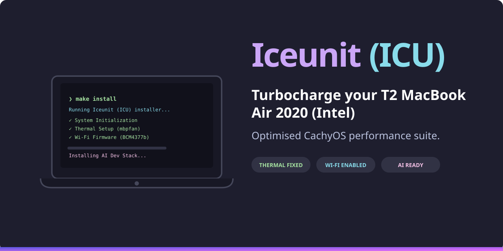

<p align="center">
  <a href="https://iceunit.com">
    
  </a>
  <br>
  <b>Turbocharge your T2 MacBook Air 2020 (Intel)</b>
</p>

# CachyOS on MacBook Air 2020 (Intel)

[](https://github.com/sebastienrousseau/cachyos-macbook-intel-2020/actions/workflows/tests.yml)
[](https://iceunit.com)
[](LICENSE)
[]()

Field-tested scripts and configuration for installing and optimising [CachyOS](https://cachyos.org) on the 2020 Intel MacBook Air (MacBookAir9,1) with Apple T2 chip. Full documentation is available at **[iceunit.com](https://iceunit.com)**.

---

## Hardware Compatibility

| Component | Status | Notes |
|---|---|---|
| Wi-Fi (BCM4377b) | Working | `brcmfmac` — firmware extraction required |
| Bluetooth (BRCM4377) | Working | `hci_bcm4377` |
| Audio (T2) | Working | `apple-bce` + PipeWire |
| Keyboard / Trackpad | Working | Via `apple-bce` USB-over-PCIe |
| Graphics (Iris Plus G7) | Working | `i915` hardware acceleration |
| Display | Working | Full native resolution |
| NVMe | Working | TRIM via `discard=async` |
| Sleep / Wake | Mostly working | Suspend fix service recommended |
| Webcam | Partial | May require `apple-bce` updates |
| Thunderbolt | Limited | Basic USB-C works |
| Touch ID | Not supported | T2 Secure Enclave — inaccessible from Linux |

---

## Quick Start

```bash
# Ensure prerequisites are installed
sudo pacman -S --needed go make git

git clone https://github.com/sebastienrousseau/cachyos-macbook-intel-2020.git
cd cachyos-macbook-intel-2020

# Run the interactive Iceunit (ICU) installer
sudo make install
```

The new installer features a beautiful, interactive CLI interface built with Go and Bubble Tea, automatically executing the post-installation optimization steps concurrently where possible.

---

## Repository Structure

```
cachyos-macbook-intel-2020/
├── .github/                     # GitHub Actions workflows
├── config/                      # System configuration drop-ins
├── docs/                        # VitePress documentation site
├── installer/                   # Go-based interactive Iceunit installer
│   ├── main.go                  # TUI orchestrator source
│   ├── main_test.go             # Installer unit tests
│   ├── go.mod                   # Go module definition
│   └── installer_bin            # Compiled binary (gitignored — built via make install)
├── mise-plugins/                # Mise plugin infrastructure for AI tools
│   ├── ollama/bin/              # Ollama version manager (list-all, download, install)
│   ├── claude-code/bin/         # Claude Code version manager
│   └── droid-factory/bin/       # Droid (Factory AI) version manager
├── scripts/                     # Core hardware automation scripts
│   ├── 00-setup-vault.sh        # Encrypted vault creation
│   ├── 00-system-init.sh        # Smart package synchronisation
│   ├── 01-thermal-setup.sh      # Fan & thermal control
│   ├── 02-wifi-firmware.sh      # Wi-Fi & Bluetooth firmware
│   ├── 03-optimise.sh           # Post-install optimisation
│   ├── 04-bootloader.sh         # Bootloader management
│   ├── 05-mount-vault.sh        # Unlock and mount vault
│   ├── 06-unmount-vault.sh      # Lock and unmount vault
│   ├── 07-install-apps.sh       # Standard application suite
│   ├── 08-maintenance.sh        # Periodic maintenance
│   └── 99-verify-install.sh     # System health audit
├── tests/                       # Unit and integration test suites
│   ├── *.bats                   # 303 unit tests (bats-core)
│   ├── Dockerfile.unit          # Unit test container
│   ├── Dockerfile.integration   # Integration test container
│   ├── setup-bats.sh            # BATS installation helper
│   ├── test_helper.bash         # Test framework & mocks
│   └── integration/             # Integration test scripts
├── workstation/                 # Workstation provisioning modules
│   ├── 05-desktop-base.sh       # Desktop foundation (GNOME, fonts, timers)
│   ├── 00-ai-dev-workstation.sh # AI/LLM & Dev stack
│   ├── 10-gnome-productivity.sh # GNOME UI tweaks
│   ├── 20-devops-tools.sh       # K8s & Cloud-native tools
│   ├── 30-security-tools.sh     # Firewall & Secrets hardening
│   ├── 40-dotfiles-link.sh      # Symbolic configuration links
│   └── 50-mise-plugins.sh      # Mise plugin infrastructure
├── bootstrap-dotfiles.sh        # Dotfiles bootstrap helper
├── install.sh                   # Unified Iceunit (ICU) installer entry point
├── Makefile                     # Task runner for install, verify, and test
├── README.md                    # Project documentation
├── LICENSE                      # MIT licence
├── CONTRIBUTING.md              # Contribution guidelines
├── SECURITY.md                  # Security policy
└── package.json                 # Documentation site dependencies
```

## Scripts

| Script | Purpose | Status | Run As | Docs |
|---|---|---|---|---|
| `00-setup-vault.sh` | Create LUKS2 encrypted vault | Optional | `make vault` | [Reference](https://iceunit.com/scripts/00-setup-vault) |
| `00-system-init.sh` | Smart package sync | **Mandatory** | `sudo make init` | [Reference](https://iceunit.com/scripts/00-system-init) |
| `01-thermal-setup.sh` | Fix fan/thermal control | **Mandatory** | `make thermal` | [Reference](https://iceunit.com/scripts/01-thermal-setup) |
| `02-wifi-firmware.sh` | Manage Wi-Fi/BT firmware | **Mandatory** | `make wifi` | [Reference](https://iceunit.com/scripts/02-wifi-firmware) |
| `03-optimise.sh` | System-wide optimisation | Recommended | `make optimise` | [Reference](https://iceunit.com/scripts/03-optimise) |
| `04-bootloader.sh` | Limine & boot management | Recommended | `make bootloader` | [Reference](https://iceunit.com/scripts/04-bootloader) |
| `05-mount-vault.sh` | Unlock and mount vault | Optional | `make mount` | [Reference](https://iceunit.com/scripts/05-mount-vault) |
| `06-unmount-vault.sh` | Lock and unmount vault | Optional | `make unmount` | [Reference](https://iceunit.com/scripts/06-unmount-vault) |
| `07-install-apps.sh` | Standard application suite | Recommended | `make apps` | [Reference](https://iceunit.com/scripts/07-install-apps) |
| `08-maintenance.sh` | Periodic maintenance | Recommended | `make maintenance` | [Reference](https://iceunit.com/scripts/08-maintenance) |
| `99-verify-install.sh` | System health audit | Recommended | `make verify` | [Reference](https://iceunit.com/scripts/99-verify-install) |

All scripts support `DRY_RUN=1` to preview changes and `--help` for usage information.

## Workstation Scripts

| Script | Purpose | Status | Run As | Docs |
|---|---|---|---|---|
| `05-desktop-base.sh` | Desktop Foundation | Recommended | `sudo` | [Reference](https://iceunit.com/workstation/05-desktop-base) |
| `00-ai-dev-workstation.sh` | AI/LLM & Dev Stack | Optional | `sudo` | [Reference](https://iceunit.com/workstation/00-ai-dev-workstation) |
| `10-gnome-productivity.sh` | GNOME Speed & UI Tweaks | Optional | User | [Reference](https://iceunit.com/workstation/10-gnome-productivity) |
| `20-devops-tools.sh` | K8s & Terraform Stack | Optional | `sudo` | [Reference](https://iceunit.com/workstation/20-devops-tools) |
| `30-security-tools.sh` | Firewall & Secrets | Optional | `sudo` | [Reference](https://iceunit.com/workstation/30-security-tools) |
| `40-dotfiles-link.sh` | Symbolic Config Links | Optional | User | [Reference](https://iceunit.com/workstation/40-dotfiles-link) |
| `50-mise-plugins.sh` | Mise Plugin Infrastructure | Optional | User | [Reference](https://iceunit.com/workstation/50-mise-plugins) |

---

## Testing & Verification

```bash
make verify             # Run the Iceunit system health audit
make test-all           # Run all tests (Lint, BATS, Go, Docker)
make lint               # Run ShellCheck and Go vet/fmt
make test               # Run unit tests locally (requires bats-core)
make test-go            # Run Go unit tests for the installer
```

---

## Documentation

The full guide is hosted at **[iceunit.com](https://iceunit.com)** and covers:

- **Getting Started** — hardware specs, compatibility status, introduction
- **Pre-Installation** — T2 security, Wi-Fi firmware, bootable USB, partition layout
- **Installation** — running the CachyOS installer, Limine bootloader setup
- **Post-Installation** — thermal setup, system optimisation, encrypted vault
- **Reference** — troubleshooting, FAQ
- **Scripts** — detailed reference for all modules

---

## Contributing

See [CONTRIBUTING.md](CONTRIBUTING.md) for script conventions, ShellCheck requirements, and the PR process.

## Licence

[MIT](LICENSE) — configurations and scripts are based on field testing on a MacBook Air 2020 (MacBookAir9,1) running CachyOS with kernel 6.19.x.

<p align="center">
  THE ARCHITECT ᛫ <a href="https://sebastien.sh">Sebastien Rousseau</a><br/>
  THE ENGINE ᛞ <a href="https://euxis.com">EUXIS</a> ᛫ Enterprise Unified Execution Intelligence System
</p>
